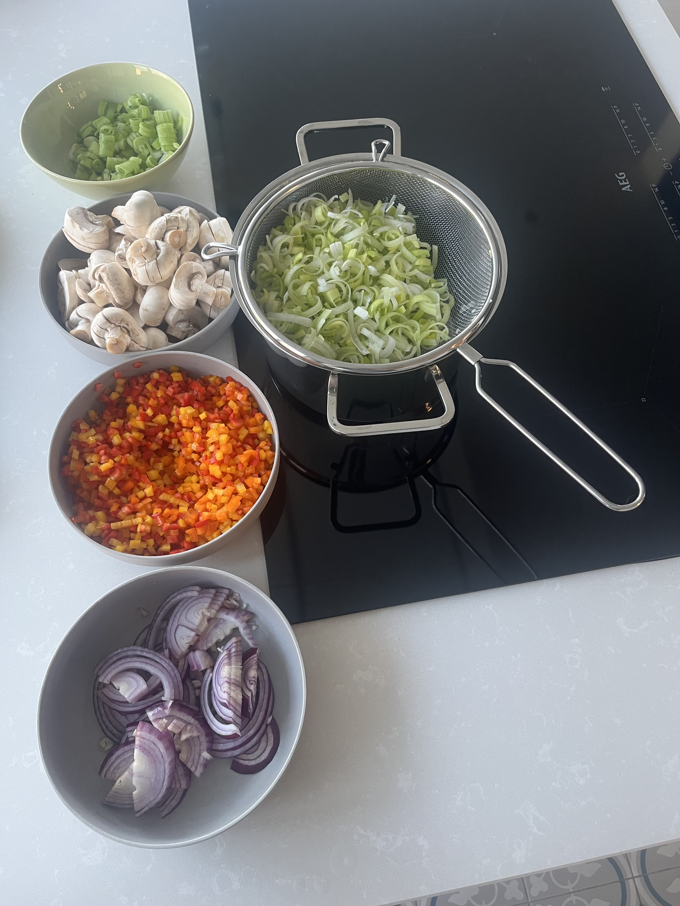

# Quiche Feestje Lander 2025

## Ingrediënten

* olijfolie;
* peper;
* zout;
* nootmuskaat;
* tijm;
* rozemarijn;
* 5 eieren;
* kookroom 250ml (7% vet - meer kan ook);
* 3 puntpaprika's: 1 gele, 1 rode en 1 oranje;
* 1 rode ui;
* 1 bussel pijpajuin (6 à 8 stuks);
* 1 preiwit (liefst van AH, want dat zijn hele grote);
* 400 gram witte champignons;
* 200 gram gruyèrekaas;
* paneermeel;
* quiche deeg ([kant en klaar van AH](https://www.ah.be/producten/product/wi419093/quiche-en-taartdeeg));
* optioneel: peterselie: droog of vers;
* optioneel: 200 à 250 gram gerookte spekreepjes (Herta).

## Bereiding

### Spekreepjes

Apart bakken in een pan, zonder boter of olie. Apart houden in een kom en laten uitlekken op een vel keukenrol.

### Champignons

In schijven snijden en bakken in een pan met olijfolie. Zout toevoegen, zodat de champignons hun vocht (sneller) loslaten.

1 koffielepel tijm en 1 koffielepel rozemarijn toevoegen. Vuur hoger zetten als de champignons hun vocht verliezen, zodat dit sneller verdampt.

Daarna mooi bruin laten bakken op lager vuur.

### Groenten

Puntpaprika's in fijne brunoise (blokjes) snijden.

Rode ajuin in fijne halve ringen snijden.

Pijpajuin in fijne ringen snijden. Het groene blad niet toevoegen: dat kan wel dienen als garnituur voor vlees of soep.

Preiwit in fijne halve ringen snijden en wassen in gootsteen (kan zand inzitten). Daarna opvissen met zeef en laten uitlekken in kastrol. Ervoor zorgen dat er zo veel mogelijk water uit de prei is, anders stooft dit minder goed.

Donkergroene blad van de prei niet gebruiken, kan wel dienen voor soep (preiwitten van AH hebben typisch niet zo veel donkergroen).

Stoverij:

* eerst enkele minuten de rode ajuin en pijpajuin stoven;
* daarna de prei toevoegen en enkele minuten verder stoven;
* als laatste de paprika brunoise toevoegen;
* uiteindelijk de champignons toevoegen en nog enkele minuten verder stoven.

Daarna mogen de groenten afkoelen, want we willen de vulling van de quiche zo koud mogelijk krijgen.

### Vulling

5 eieren opkloppen in een grote kom en de kookroom geleidelijk aan toevoegen.

Daarna op smaak brengen met zout, peper en nootmuskaat.

De vulling mag proeven alsof het "te sterk gekruid" is: bij toevoegen van de rest later, zwakt dit toch terug af.

Als de groenten voldoende zijn afgekoeld, mogen ze toegevoegd worden aan deze kom. Optioneel spek kan ook toegevoegd worden.

De geraspte gruyèrekaas mag nu ook toegevoegd worden.

### Deeg

Bakvorm insmeren met wat olijfolie. Daarna het kant en klaar deegvel in de bakvorm steken en tegen de kanten drukken naar boven.

In de bodem mogen verschillende gaten geprikt worden met een vork.

De bodem mag bedekt worden met paneermeel: dit neem het vocht van de vulling op en moet ervoor zorgen dat het deeg krokanter blijft.

Daarna mag de vulling in de bakvorm geschept worden met pollepels. Daarna met een eetlepel de textuur van de vulling gelijk strijken overal.

De deeg tegen de kanten van de bakvorm kan nu met een eetlepel wat naar beneden gedrukt worden, zodat het gelijk komt te zitten met de vulling.

### Oven

Oven mag voorverwarmd worden op 180 graden.

Quiche mag dan 30 minuten in de oven.

Daarna mag de quiche eruit om de peterselie (droog of vers) toe te voegen bovenaan.

Daarna de quiche nog 2 minuten in de oven op de **grillstand** om de bovenkant mooi bruin te krijgen.

### Eindresultaat

